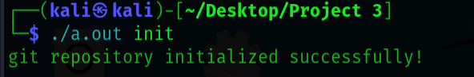
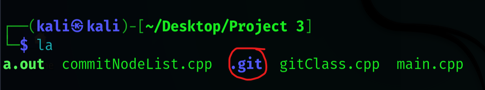
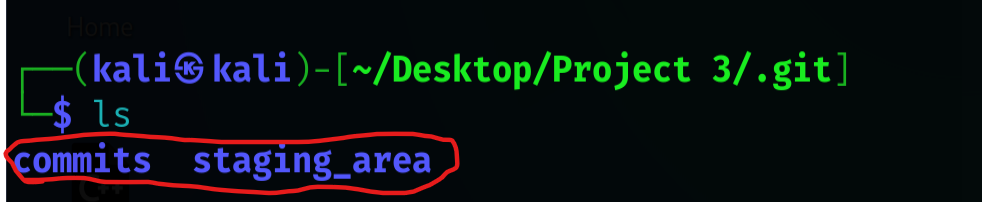
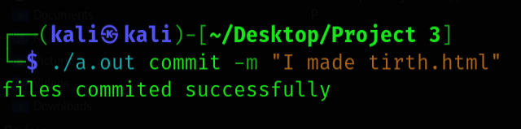
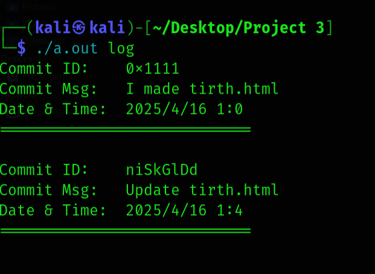

# 🚀 Version Control System in C++  

---

## 📌 Overview
First of all thank you so much to Uzair Ahmed .  
Welcome to the **Version Control System!**  
We are the **🧙‍♂️ Bitwise Wizards**, and we have researched a fully functional version control system using **C++** for the project of **IT206** from DAU.  
This project replicates core functionalities of tools like **Git**, allowing users to:

- 🗂️ Manage file versions  
- 🔍 Track changes  
- 🔄 Revert to previous states  

—all within a custom-built system designed from scratch.

---

## 🗂️ File Structure

## File Structure
```
📦 Tetris_Game
 └── 💚 Sec                    → Code Files 
        └── main.cpp
        └── commitNode.cpp
        └── gitClass.cpp

 └── 💚 README.md              → Project documentation

```

---

## Project Overview 

Here They have used the ` int main(int argc, char * argv[]) ` . This project is inspired by Git . This project supports committing changes and can be used with Git, which is a major advantage that many developers appreciate.

---

## 	Data Structure Used


| Feature                   | Data Structure Used            |
|---------------------------|-------------------------------|
| Commit history            | Singly Linked List            |
| File selection for staging| Array of strings              |
| File system operations    | Filesystem library (iterator) |
| Commit/message storage    | String                        |

And they have used the object oriented programming (OOPs). 

---
## 🚀 Project Source

Explore the main source files of this project:

📁 **Src/**  
&nbsp;&nbsp;&nbsp;&nbsp;📄 [`main.cpp`](./code files/main.cpp) — Entry point of the project with the main logic.  
&nbsp;&nbsp;&nbsp;&nbsp;📄 [`commitNode.cpp`](./code files/commitNodeList.cpp) — Handles commit node structure and logic.  
&nbsp;&nbsp;&nbsp;&nbsp;📄 [`gitClass.cpp`](./code files/gitClass.cpp) — Contains the core Git-related class implementations.

---

## Improvement We did 

previously the old code doesn't work on the `./git --help`.We Implement it in the project 

---

## How to Run 

```
g++ -o git main.cpp
```
You Should me in that folder where source files are there . 

```
./git init
```

To initialize the repo . Here instead of using the git , You can use the hole path if are in the other folder . 


## Detailed Explanation

If you type ./git init it will creat hidden folder name as `.git` . and What this do , it will store the commits and Staging environment . 
Put all files in the folder `Project 3` . 

**Step 1 :**<br>
```
Type |-> g++ main.cpp

```
**Step 2 :**
```
Type |-> ./a.out init
 
```


Here , `.git` is the hidden folder . 

**Step 3 :**<br>
Now We will look into the `.git` folder . 

Here commits foder `commits` folder contains the commits which will use the Linked list.And `staging_area` folder stores the your project . 

**Step 4 :**<br>
Let's add the html file in the Project folder .
```
Type |-> ./a.out add .
```
**Step 5 :**<br>

Let's Commit the git repo . 
```
Type |-> ./a.out commit -m "<Commant>"
```


**Step 6**
```
Type |-> ./a.out log
```

Here `log` funtion gives us the inforantion of the commits we have did till now . 

