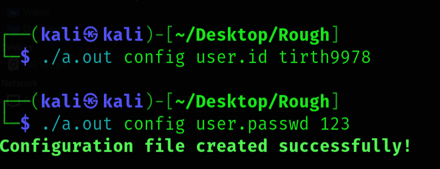

# 🚀 Version Control System in C++  

---

## 📌 Overview
First of all thank you so much to Uzair Ahmed .  
Welcome to the **Version Control System!**  
We are the **🧙‍♂️ Bitwise Wizards**, and we have researched a fully functional version control system using **C++** for the project of **IT206** from DAU.  
This project replicates core functionalities of tools like **Git**, allowing users to:

- 🗂️ Manage file versions  
- 🔍 Track changes  
- 🔄 Revert to previous states  

—all within a custom-built system designed from scratch.

---

## 🗂️ File Structure

## File Structure
```
📦 Version Control System 
 └── 💚 Sec                    → Code Files 
        └── main.cpp
        └── commitNode.cpp
        └── gitClass.cpp

 └── 💚 README.md              → Project documentation

```

---

## Project Overview 

Here They have used the ` int main(int argc, char * argv[]) ` . This project is inspired by Git . This project supports committing changes and can be used with Git, which is a major advantage that many developers appreciate.

---

## 	Data Structure Used


| Feature                   | Data Structure Used            |
|---------------------------|-------------------------------|
| Commit history            | Singly Linked List            |
| File selection for staging| Array of strings              |
| File system operations    | Filesystem library (iterator) |
| Commit/message storage    | String                        |

And they have used the object oriented programming (OOPs). 

---
## 🚀 Project Source

Explore the main source files of this project:

📁 **Src/**  
&nbsp;&nbsp;&nbsp;&nbsp;📄 [`main.cpp`](./code files/main.cpp) — Entry point of the project with the main logic.  
&nbsp;&nbsp;&nbsp;&nbsp;📄 [`commitNode.cpp`](./code files/commitNodeList.cpp) — Handles commit node structure and logic.  
&nbsp;&nbsp;&nbsp;&nbsp;📄 [`gitClass.cpp`](./code files/gitClass.cpp) — Contains the core Git-related class implementations.

---
## Running Path :
```
[ main.cpp ] -> [ gitClass.cpp ] -> [ commitNodeList.cpp ]
          ⬇️
Commands handing via argv/argc
          ⬇️
File Operation and staging 
          ⬇️
Linked List commits
          ⬇️
File version Snapshort in Directions

```


## Improvement We did 

previously the old code doesn't work on the `./git --help`.We Implement it in the project 

---

## How to Run 

```
g++ -o git main.cpp
```
You Should me in that folder where source files are there . 

```
./git init
```

To initialize the repo . Here instead of using the git , You can use the hole path if are in the other folder . 


## 📘 Detailed Explanation

If you type `./a.out init`, it will create a hidden folder named `.git`.  
It will store the commits and the staging environment.  
Put all files in the folder `Project 3`.

---

### 🛠️ Step 1: Compile the Code

```
bash : g++ main.cpp
```
### Step 2: Adding to the Staging Area 🧺✨
```
Type |-> ./a.out init
 
```


Here , `.git` is the hidden folder . 

### 🗂️ Step 3: Explore the .git Folder 🔍📁<br>
Now We will look into the `.git` folder . 

Here commits foder `commits` folder contains the commits which will use the Linked list.And `staging_area` folder stores the your project . 

### ➕ Step 4: Add Files to Staging Area 📄✨

Let's add the html file in the Project folder .
```
Type |-> ./a.out add .
```
### 📝 Step 5: Commit the Changes ✅🗃️

Let's Commit the git repo . 
```
Type |-> ./a.out commit -m "<Commant>"
```


### 📜 Step 6: View Commit History 🕘🧾
```
Type |-> ./a.out log
```

Here `log` funtion gives us the inforantion of the commits we have did till now . 

---

# 🚀 Improvements We Made

## 🧑‍💻 (1) Configuration of User

We have added the configuration of user and it will give you the who did changes . 
For that user must do configuration for usering the git commands . 
```
./a.out config user.id <UserName>  (For user Name)
      
./a.ot config user.passwd <Password> (For Password)
```




## 📖 (2) Addition of the `--help` Command

We added the `--help` command ❓ to display all available commands and their usage 📋.  
It helps users understand how to use the version control system with ease 💡.
```
./a.out --help
```
---

# 🌟 Future Ideas

1. 🧑‍💻 Improve user configuration by allowing integration with platforms like **GitHub.com** and other remote repositories 🌐.  
2. 📤📥 Add support for more Git-like features such as `push` and `pull` to interact with remote repositories.  
3. 🌿 Implement **Branching Support** to allow users to create and switch between multiple development branches — just like in Git.  
4. 🔀 Develop **Merge Functionality** to merge branches and handle basic conflict resolution with clarity.
---

# 👨‍🔬 Researchers & 👥 Contributors

1. 👨‍💻 [Tirth Patel](https://github.com/Tirth9978)  
2. 👨‍💻 [Raj Patel](https://github.com/Raj-Patel7807)  
3. 👨‍💻 [Shlok Patel](https://github.com/Shlok-Patel-007)  
4. 👨‍💻 [Prakriti Pandey](https://github.com/PrakritiPandey2024)

---
# 📚 Reference

🙏 Special thanks to [Uzair Ahmed](https://github.com/uzairahmednasir) for the original idea and implementation. 

🔗 GitHub Repository: [Version Control System](https://github.com/uzairahmednasir/version-control-system)

